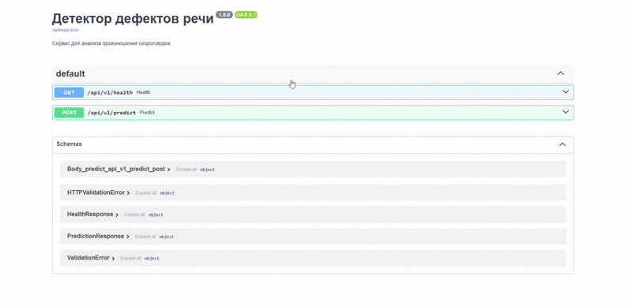
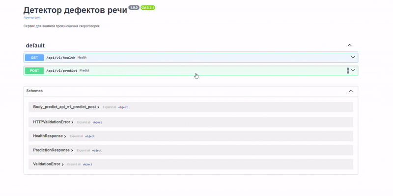

# **Детекция дефектов речи по скороговоркам** 
## **Speech Defect Detection System Using Tongue Twisters**

## Описание проекта

Ранняя диагностика речевых нарушений (дислалия, заикание, шепелявость) у детей критически важна для их успешной коррекции. Однако не все родители имеют возможность регулярно посещать логопеда. Данный проект представляет собой веб-сервис, который по аудиозаписи скороговорки автоматически определяет качество произношения («хорошо» / «плохо») и указывает на конкретные проблемные звуки (например, «р», «л», «ш», «ц»). Проект представляет собой сервис, решающий эту задачу.

## Описание данных

Используется датасет, предоставленный научным руководителем. Очищенный датасет содержит аудиозаписи детей, произносящих скороговорки, с бинарной разметкой:
- **«хорошо» (0)** – 1875 записей
- **«плохо» (1)** – 897 записей

Всего в датасете 42 уникальных типа скороговорок, каждая из которых проверяет определённые звукосочетания (например, `трл`, `стрш`, `чстрл`). Аудиофайлы имеют формат WAV, названия содержат уникальный идентификатор и код скороговорки после двойного подчёркивания.

Подробнее о структуре и предобработке данных можно узнать в [EDA-ноутбуке](eda/EDA.ipynb).

## Разведочный анализ (EDA) аудиоданных

Был проведён разведочный анализ, в ходе которого:
- Оценены длительности аудио (средняя ~10.4 сек, медиана ~8.9 сек).
- Выявлены выбросы (файлы короче 2 секунд) – они были удалены.
- Визуализированы осциллограммы и спектрограммы для примеров «хорошего» и «плохого» произношения.
- Проанализировано распределение записей по 42 типам скороговорок и доля дефектов для каждой группы.
- Обнаружено, что наибольшие трудности вызывают скороговорки, содержащие звуки «р», «л», «ц», «ш» в сложных сочетаниях (например, `чтрлц`, `чстрш`).

Результаты EDA позволили обосновать выбор признаков (MFCC) и необходимость учёта дисбаланса классов.

## Baseline-модель (ML)

В качестве baseline выбрана **SVM с RBF-ядром** на MFCC-признаках (255 числовых признаков на запись). MFCC-признаки включают средние и стандартные отклонения 40 коэффициентов, их дельт и дельта-дельт, а также спектральные характеристики (центроид, ширина, контраст, ZCR, RMS). Обучение проводилось с учётом дисбаланса классов (`class_weight='balanced'`).

**Результаты на тестовой выборке:**
- Accuracy: 74.1%
- F1 (плохо): 0.62
- ROC-AUC: 0.797

Baseline-модель показала стабильный результат и легла в основу веб-сервиса.

## Эксперименты с ML-моделями

Были обучены и сравнены несколько классических алгоритмов:
- Логистическая регрессия
- Случайный лес (Random Forest)
- SVM (RBF)
- LightGBM
- CatBoost

Лучшие результаты (по F1 для класса «плохо») показала SVM. LightGBM и CatBoost дали сопоставимое качество, но уступили по устойчивости на несбалансированных данных. Подробные таблицы и гиперпараметры приведены в [ML-ноутбуке](MLModels/mlmodels.ipynb).

## Применение моделей глубокого обучения (CNN)

Также были проведены эксперименты со свёрточными нейронными сетями на мел-спектрограммах. Использовались архитектуры от простой (3 свёрточных слоя) до более сложных. Лучшая из CNN достигла F1 = 0.632 и ROC-AUC = 0.779, что близко к SVM. Однако учитывая меньшие требования к ресурсам и простоту интерпретации, для сервиса была выбрана SVM.

Результаты экспериментов с CNN описаны в [DL-ноутбуке](DLModels/cnn.ipynb).

## Разработка микросервиса

Взаимодействие с моделью реализовано с помощью **FastAPI** (бэкенд) и **Streamlit** (фронтенд). Оба модуля упакованы в **Docker-контейнеры** и оркестрируются через `docker-compose`. 

**FastAPI** предоставляет REST API для загрузки аудиофайла и получения предсказания. **Streamlit** обеспечивает удобный веб-интерфейс: выбор скороговорки из пяти рекомендованных, отображение текста и проверяемых звуков, загрузку или запись аудио (через микрофон), построение осциллограммы, вывод результата и советы по проблемным звукам. Также реализована история проверок и словарь упражнений для каждого звука.

Проект развёрнут на VPS Cloud.ru. Посмотреть работу FastAPI можно по адресу:  
[http://185.50.202.205:54545/api/v1/health](http://185.50.202.205:54545/api/v1/health)  

Streamlit-приложение доступно по адресу:  
[http://185.50.202.205:8501](http://185.50.202.205:8501)

### Веб-интерфейс FastAPI

- **Запуск FastAPI-приложения**  
  Бэкенд сервиса реализован на FastAPI и предоставляет REST API для анализа аудиозаписей скороговорок.  
  Интерактивная документация (Swagger UI) доступна по адресу:  
  `http://185.50.202.205:54545/docs`

- **GET `/api/v1/health`**
  - **Метод:** GET
  - **Описание:** Проверка работоспособности сервиса, наличия загруженной модели.
  - **Ответ:** `{"status": "ok"}`
  - **Код ответа:** 200 OK

  

- **POST `/api/v1/predict`**
  - **Метод:** POST
  - **Описание:** Основной эндпоинт сервиса. Принимает аудиофайл (WAV, MP3, OGG) и опционально тип скороговорки. Возвращает:
    - `prediction` – «хорошо» или «плохо»;
    - `probability` – вероятность того, что речь дефектная;
    - `problematic_sounds` – список звуков, которые вероятнее всего нарушены (если передан тип скороговорки и модель предсказала «плохо»).
  - **Параметры запроса:**  
    - `file` – аудиофайл (обязательный);
    - `twister` – тип скороговорки (строка, необязательный).
  - **Пример ответа:**
    ```json
    {
      "prediction": "плохо",
      "probability": 0.784,
      "problematic_sounds": ["р", "л", "ш"]
    }
  - **Коды ответа:**  
    - `200 OK` – успешное предсказание;
    - `422 Bad Request` - неподдерживаемый формат файла;
  
  

### Приложение Streamlit

Streamlit-приложение предоставляет удобный веб-интерфейс для родителей и логопедов. Оно состоит из одной основной страницы, на которой реализованы все ключевые функции:

**Выбор скороговорки**  
Пользователь выбирает одну из пяти рекомендованных скороговорок: `рлш`, `стр`, `трш`, `стрлш`, `чстрл`.

**Отображение текста и проверяемых звуков**  
Для выбранной скороговорки показывается её текст и перечень звуков, которые она проверяет (например, «р», «л», «ш»).

**Два способа загрузки аудио**  
- Запись через микрофон (требует разрешения браузера) – пользователь нажимает кнопку «Начать запись», произносит скороговорку и останавливает запись.  
- Загрузка готового файла – поддерживаются форматы WAV, MP3, OGG.

**Визуализация осциллограммы**  
Сразу после загрузки или записи строится график зависимости амплитуды от времени — осциллограмма.

**Анализ и результат**  
После нажатия кнопки «Определить дефекты речи» отправляется запрос к бэкенду. Отображается результат:  
- «хорошо» — зелёное сообщение с вероятностью дефекта (обычно низкая).  
- «плохо» — красное сообщение с вероятностью дефекта и списком проблемных звуков.

**Советы по улучшению произношения**  
Для каждого проблемного звука выводится краткое упражнение (например, для звука «р» – «Моторчик», для «л» – «Улыбнитесь, прикусите язык»).  
В боковой панели есть раздел «Словарь советов», где можно прочитать упражнения для всех звуков заранее.

**История проверок**  
Все выполненные проверки сохраняются в боковой панели с указанием времени, выбранной скороговорки, результата и вероятности. Хранится до 10 последних записей.


## Инструкция по запуску

### 1. Клонирование репозитория
```bash
git clone https://github.com/Ilya-Klim/Speech-Defect-Detection-System.git
cd Speech-Defect-Detection-System
```
### 2. Локальный запуcк (без Docker)
Установите poetry:
```
poetry install
```
Запуск бэкенда (FastAPI):
```
uvicorn Backend.app.main:app --host 127.0.0.1 --port 54545 --reload
```
Запуск клиента (Streamlit) в другом терминале:
```
streamlit run Client/app_client.py --server.port=8501 --server.address=127.0.0.1
```
При возникновении ошибок с импортом Client или Tools установите переменную окружения PYTHONPATH в корень проекта. И после запустите снова сервисы
```
$env:PYTHONPATH = "A:\<ваш_путь>\Speech-Defect-Detection-System"  
```
### 3. Запуск с использованием Docker
```
docker compose up -d --build
```
Описание docker-compose: В данном сервисе поднимаются 2 объединенных докер контейнера с веб-приложением FastApi и веб-приложением Streamlit.

После этого сервисы будут доступны:

- Бэкенд: http://localhost:54545

- Клиент: http://localhost:8501

## Virtual Private Server

Приложение развернуто на VPS от Cloud.ru.
Ниже представлена инструкция по развертыванию приложения на VPS от Cloud.ru:

Для начала зайдите на официальный сайт Cloud.ru, чтобы создать новую виртуальную машину (VM). Выберите вариант с бесплатным тарифом (free tier).

Далее нам предложат список предустановленных программных компонентов для вашей новой виртуальной машины. Можете выбрать наиболее подходящие опции в зависимости от ваших потребностей.

Рекомендуется сразу настроить SSH-соединение для более удобного доступа к серверу. После завершения настройки вы сможете подключаться к машине двумя способами: либо напрямую через веб-интерфейс сайта, используя пароль, либо через SSH.

Из списка можем выбрать что будет предустановлено у нас на сервер.

После создания машины мы можем как сразу подключиться к ней через интерфейс сайта по паролю, так и по ssh
```
ssh -i ~/.ssh/<cloudru-key> <login>@<ip>
```
По умолчанию там запускается -sh, которая не очень удобна для работы. Чтобы переключиться на стандартный Bash, выполните команду /bin/bash.

Теперь у нас настроена базовая виртуальная машина, но без доступа к интернету и открытым портам. Для открытия нужных портов следуйте инструкциям на официальном сайте Cloud.ru. Например, этой: https://cloud.ru/docs/marketplace/ug/services/mind-migrate/mind__subnet-configuration.html#id4.

Не забудем также убедиться, что внутренние брандмауэры на самой виртуальной машине разрешают использование этих портов. В системе Ubuntu это делается через утилиту UFW, а в других системах – через команды вроде firewall-cmd.

Как проверить работоспособность открытых портов? Попробуем отправить запрос на [185.50.202.205:54545](). Если мы можем получить ответ, значит порт открыт.

Если вы используете Windows, попробуйте выполнить следующую команду:
```
Test-NetConnection <ip> -Port 54545
```
Она выведет результат проверки соединения, например: TcpTestSucceeded : False

Если вы работаете в Linux, воспользуйтесь командой telnet:
```
telnet <ip> 54545
```
Но почему Windows выдает что порт закрыт по протоколу TCP, хотя сам хост отвечает на запросы ICMP (ping). Это происходит потому, что на данном порте еще нет запущенного приложения, которое могло бы принимать входящие соединения.

Чтобы протестировать работу порта в Linux, вы можете использовать команду netcat (nc) для запуска простого сервера на нужном порте:
```
netcat -l 8501
```
Далее уже можно запускать готовое приложение
```
git clone -branch <feature-fastapi>> <progect http url >
docker compose up -d --build
```
И теперь на: 8501 можно будет увидеть готовое приложение
___